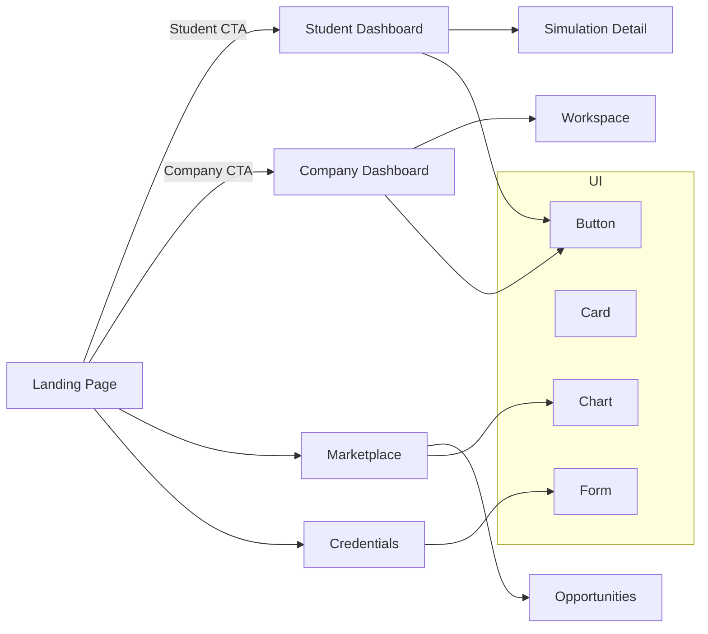

# AETHER — Upgrading Existing Industries and Preparing a Workforce for the Next-Gen Industries

AETHER is a web platform dedicated to upgrading existing industries and preparing a workforce for the next-gen industries in Thailand. It connects university students, companies, and administrators through learning simulations, workforce analytics, industry partner onboarding, and verified credentials.

## Overview

- Landing page with student and company CTAs
- Student dashboard with simulation and credential access
- Company dashboard for partner analytics and pilot tracking
- Admin dashboard for platform monitoring
- Marketplace and opportunities views for matching and credential discovery

## Tech Stack

- **React 18** + **TypeScript**
- **Vite**
- **Tailwind CSS** + **shadcn/ui**
- **React Router v6**
- **TanStack Query**
- **Framer Motion**
- **Recharts**

## Quick Start

```bash
cd /Users/test/Downloads/aether-thailand
npm install
npm run dev
```

Open the local URL shown in the terminal (usually `http://localhost:4173`).

## Production Build

```bash
npm run build
```

## GitHub Upload

If you have already initialized git and added a remote:

```bash
git add .
git commit -m "Update README"
git push origin main
```

## Project Structure

```text
src/
├── components/        # shared UI components and layout wrappers
├── components/ui/     # button, dialog, input, table, and other UI primitives
├── hooks/             # reusable React hooks
├── lib/               # utilities and mock data
├── pages/             # route-level pages
│   ├── Landing.tsx
│   ├── Marketplace.tsx
│   ├── StudentDashboard.tsx
│   ├── CompanyDashboard.tsx
│   ├── UniversityDashboard.tsx
│   ├── AdminDashboard.tsx
│   ├── Workspace.tsx
│   ├── Credentials.tsx
│   ├── Opportunities.tsx
│   └── SimulationDetail.tsx
├── App.tsx
├── index.css
└── main.tsx
```

## Architecture Diagram



> This diagram shows the core page flow and major interface components.

## Deployment

The app can be deployed to platforms such as **Vercel**, **Netlify**, or **GitHub Pages**. Configure the build command as:

```bash
npm run build
```

Use the `dist` folder as the publish directory.
